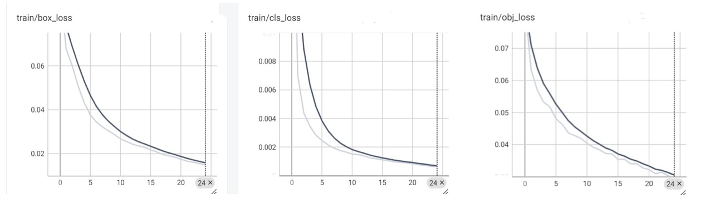
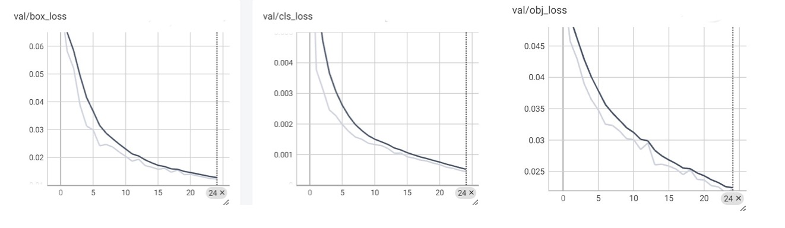
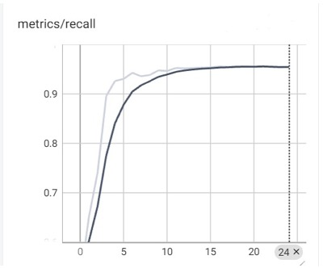
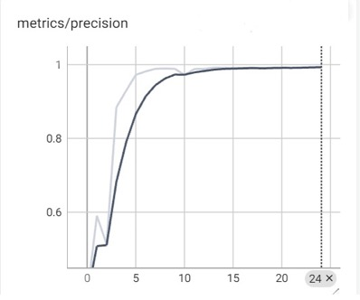

# 🚗 YOLOv5 Object Detection in CARLA (Day → Night Generalization)

> 🚀 Built a YOLOv5-based object detection pipeline in CARLA Simulator and evaluated its robustness under domain shift (day → night conditions).

---

## 📌 Project Summary

Developed an object detection pipeline using **YOLOv5** within the CARLA simulation environment.

The objective was to **train the model under well-lit (daytime) conditions and evaluate its performance in low-light/night-time scenarios**, simulating real-world deployment challenges in autonomous driving.

This project highlights how perception systems behave under **domain shift**, particularly changes in lighting conditions.

---

## 🛠️ Tech Stack

- Python  
- PyTorch  
- YOLOv5  
- OpenCV  
- CARLA Simulator  

---

## 💡 Key Contributions

- Built an end-to-end pipeline: data generation → preprocessing → training → deployment  
- Evaluated model robustness under domain shift (day → night)  
- Performed class-wise performance analysis (vehicles vs pedestrians)  
- Deployed the model for real-time inference inside CARLA  

---

## 🏆 Results

- **mAP@0.5:** 98.5% (daytime / training conditions)  
- **mAP@0.5–0.95:** 85.7% (night-time testing)  

The model demonstrates strong generalization but shows **performance degradation under low-light conditions**.

### 🔍 Observations

- Pedestrians → highly accurate detection  
- Trees → consistent performance  
- Vehicles → reduced accuracy due to limited samples and low visibility  

---

## 🧠 Problem Statement

Most computer vision models perform well under the same conditions they are trained on, but struggle when environmental conditions change.

This project investigates:

> How does a model trained in daylight perform under night-time conditions?

---

## 🏗️ Methodology

### 1. Data Collection
- Generated dataset using CARLA  
- Captured RGB images and segmentation data  
- Created custom labeled dataset  

### 2. Preprocessing
- Converted annotations from **VOC (XML) → YOLO format**  
- Applied augmentations:
  - Brightness reduction  
  - Blur (to simulate night conditions)  

### 3. Model Training
- Model: YOLOv5s  
- Image size: 640 × 640  
- Epochs: 25  
- Train/Validation split: 80/20  

### 4. Deployment
- Integrated trained model into CARLA  
- Configured simulation to night-time  
- Performed real-time object detection using ego vehicle camera  

---

## ⚙️ Setup Instructions

### 1. Clone the repository
```bash
git clone https://github.com/Nithya-Kanakam/yolov5-carla-nighttime-object-detection.git
cd yolov5-carla-nighttime-object-detection
````

### 2. Install dependencies

```bash
pip install -r requirements.txt
```

### 3. Clone YOLOv5

```bash
git clone https://github.com/ultralytics/yolov5
cd yolov5
pip install -r requirements.txt
```

---

## 📂 Dataset

The dataset was generated using CARLA.

* Not included in this repository due to size
* Download here: **[ADD YOUR LINK – Google Drive / Kaggle]**

### Structure:

```bash
dataset/
├── images/
│   ├── train/
│   └── val/
├── labels/
│   ├── train/
│   └── val/
```

---

## 🏋️ Training

```bash
python train.py --img 640 --batch 16 --epochs 25 --data ../data.yaml --weights yolov5s.pt --name yolov5_carla
```

---

## 🎮 Deployment

```bash
python ../src/deploy.py
```

This will:

* Launch CARLA simulation
* Load trained weights (`best.pt`)
* Perform real-time object detection in night conditions

---

## 📊 Evaluation Metrics

| Metric       | Value |
| ------------ | ----- |
| Precision    | 99.3% |
| Recall       | 95.4% |
| mAP@0.5      | 98.5% |
| mAP@0.5–0.95 | 85.7% |

---

## 📊 Training Performance

The following graphs show the training behavior and evaluation metrics monitored using TensorBoard.

### 📉 Training vs Validation Loss



---

### 📈 mAP, Precision & Recall




💡 The loss curves show smooth convergence, indicating stable training, while the mAP, precision, and recall curves demonstrate strong performance and good generalization.

---

## 🔦 Key Insights

* Models are sensitive to lighting variations
* Training data diversity is critical for robustness
* Real-world deployment introduces challenges beyond training environments

---

## 📁 Project Structure

```bash
├── src/
│   ├── data.py
│   ├── xml_to_txt.py
│   ├── deploy.py
│
├── dataset_sample/
├── results/
├── docs/
│   ├── project_presentation.pdf
│   ├── description.docx
│
├── data.yaml
├── requirements.txt
└── README.md
```

---

## 🚀 Future Work

* Improve vehicle detection with balanced dataset
* Extend to adverse weather (rain, fog)
* Apply domain adaptation techniques for better generalization

---

## 👥 Team

* Nithya Kanakam
* Keerthana Kothakapu Adamulla

---

## ⭐ Final Note

This project demonstrates how perception models behave under domain shift and highlights the importance of robustness in real-world autonomous systems.
